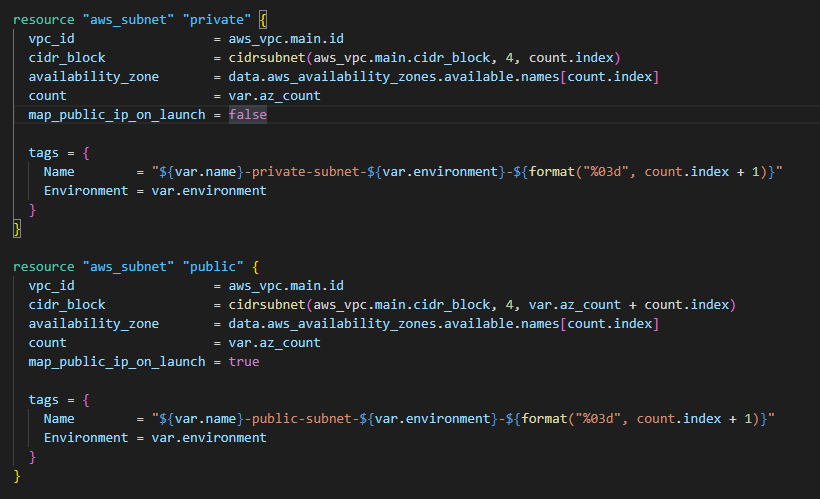
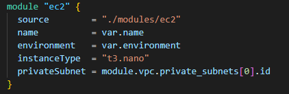
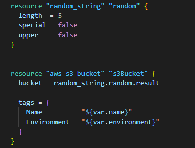
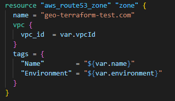
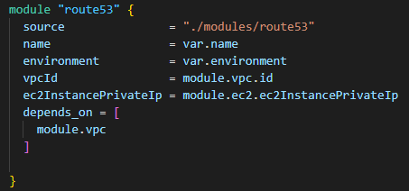

# Terraform-Task

## Layout
```text
.
modules/    -> consists all modules
├─ route53/ -> IAC related to Route53
├─ ec2/     -> IAC related to EC2
├─ s3/      -> IAC related to s3
├─ vpc/     -> IAC related to VPC
output/     -> terraform plan output file inside this folder
main.tf     -> module imported for building infra 
vars.tf     -> variables stored for infra
```
- As we have a simple infra, I didn't create a separate provider.tf file so I added provider details inside the main file itself.


### 1x VPC (192.168.50.0/16) with 4 subnets:

- The CIDR provided was not valid so I continued with 192.168.0.0/16

<div align="center">
<a>
    
  </a>
</div>

### 1x EC2 Instance (t3.nano) - Deploy the instance to one of the Private Subnets

<div align="center">
<a>
    
  </a>
</div>


###  1x S3 Bucket (choose a random name using the random Terraform Provider)

<div align="center">
<a>
    
  </a>
</div>

### 1x Internal Route53 Zone geo-terraform-test.com

<div align="center">
<a>
    
  </a>
</div>

### 1x Route53 Record instance-test.geo-terraform-test.com pointing to the Instance's Private IP Address created in above step.

<div align="center">
<a>
    
  </a>
</div>
